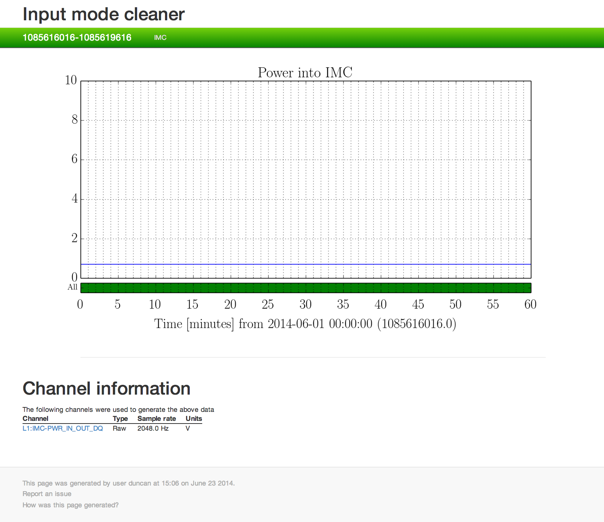

###############
What is GWSumm?
###############

The `gwsumm` package ('the summary pages') is a python toolbox that can be
used to generate a structured HTML webpage displaying graphical data that
describe any and all aspects of gravitational-wave interferometer performance.
The summary pages were developed in collaboration between the LIGO Laboratory
and the GEO600 project with the goal of generating an automated daily summary
of laser-interferometer operations and performance.

The LIGO Summary Pages are used to characterize and monitor the status
of the detectors and their subsystems. In addition, data products and
webpages from other analysis tools are included in the Summary Pages.

The output acts as a kind of daily magazine, allowing instrument scientists
and data analysis teams a archived, searchable summary of the key figures of
merit that will determine the sensitivity and ultimately the science output
of these instruments.

Those readers who are members of the LIGO Scientific Collaboration, the Virgo
Collaboration, or KAGRA can view the current LIGO summary pages at the
following sites:

== =======================================================
H1 https://ldas-jobs.ligo-wa.caltech.edu/~detchar/summary/
L1 https://ldas-jobs.ligo-la.caltech.edu/~detchar/summary/
== =======================================================

Working model
=============

The GWSumm package provides an abstract set of classes from which any user
can build their own python program to read, manipulate, and display data.
However, for the specific purpose of the LIGO instrumental summary pages,
the `gw_summary` command-line executable is used to read in a number of
INI-format configuration files that define what data should be read, how it
should be manipulated, and how it should all be displayed.

These configuration files are made up ``[tab-xxx]`` section with the following
format:

.. code-block:: ini

  [tab-IMC]
  name = Input mode cleaner
  shortname = IMC
  1 = L1:IMC-PWR_IN_OUT_DQ timeseries
  1-ylim = 0,80
  1-title = 'Power into IMC'
  [html]
  issues =

This block defines the ``IMC`` tab, with a ``name`` (and a ``shortname``):
a single ``timeseries`` plot of the ``L1:IMC-PWR_IN_OUT_DQ`` channel.
The plot has been customised with a y-axis limit and a title. This
also defines the required ``[html]`` section, where the required key
``issues`` is defined. This example can be saved to a file called ``imc.ini``.

This tab is then generated by passing it to the `gw_summary` executable, along
with some GPS times over which to run:

.. code-block:: bash

   $ gw_summary gps 'Feb 29 2020 00:00' 'Feb 29 2020 01:00' --config-file imc.ini

This minimal setup will produce the following HTML page
`1266969618-1266973218/imc/index.html`:

