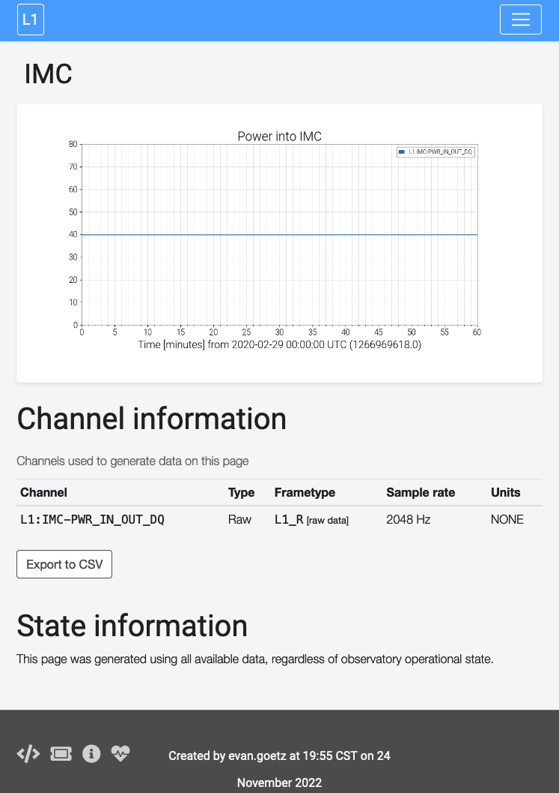

###############
What is GWSumm?
###############

The `gwsumm` package ('the summary pages') is a python toolbox that can be
used to generate a structured HTML webpage displaying graphical data that
describe any and all aspects of gravitational-wave interferometer performance.
The summary pages were developed in collaboration between the LIGO Laboratory
and the GEO600 project with the goal of generating an automated daily summary
of laser-interferometer operations and performance.

As of summary 2014, the summary pages are extensively used to characterise
data from the new `Advanced LIGO <https://www.advancedligo.mit.edu/>`_
instruments as they are being commissioned for future observing runs.

The output acts as a kind of daily magazine, allowing instrument scientists
and data analysis teams a archived, searchable summary of the key figures of
merit that will determine the sensitivity and ultimately the science output
of these instruments.

Those readers who are members of the LIGO Scientific Collaboration, the Virgo
Collaboration, or KAGRA can view the current LIGO summary pages at the
following sites:

== =======================================================
H1 https://ldas-jobs.ligo-wa.caltech.edu/~detchar/summary/
L1 https://ldas-jobs.ligo-la.caltech.edu/~detchar/summary/
== =======================================================

Working model
=============

The GWSumm package provides an abstract set of classes from which any user
can build their own python program to read, manipulate, and display data.
However, for the specific purpose of the LIGO instrumental summary pages,
the `gw_summary` command-line executable is used to read in a number of
INI-format configuration files that define what data should be read, how it
should be manipulated, and how it should all be displayed.

These configuration files are made up ``[tab-xxx]`` section with the following
format:

.. literalinclude:: ../share/examples/imc.ini
   :language: ini

This block defines the ``IMC`` tab, with a ``name`` (and a ``shortname``),
which should contain a single ``timeseries`` plot of the
``L1:IMC-PWR_IN_OUT_DQ`` channel.
The plot has been customised with a y-axis limit and a title.

This tab is then generate by passing it to the `gw_summary` executable, along
with some GPS times over which to run:

.. code-block:: bash

   $ gw_summary gps 'June 1 2014 00:00' 'June 1 2014 01:00' --config-file imc.ini

This minimal setup will produce the following HTML page:

